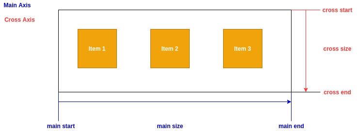

## What is flexbox ?

CSS flexible box module -> one dimensional layout model

- flexible and efficient model
- distribute space among items
- control their alignment

---

Before flexbox their are for layout modes
 
 - Block, for sections in a webpage
 - Inline, for text
 - Tables, for two dimensional table data
 - Positioned, for explict position of element


 ---

## Why flexbox ?

 - lot of flexibity
 - arrange items
 - spacing
 - alignment
 - order of items
 - bootstrap 4 is built on the on flex layout

 ---

 ### Terminology

 Flexbox contains two main elements

 -  Flex Container
 -  Flex items

 ```
<div class = "container>
    <div>Item-1</div>
    <div>Item-2</div>
    <div>Item-3</div>
</div>
```
Here the parent div is container and the child div's are items

---

## flexbox axis



---
